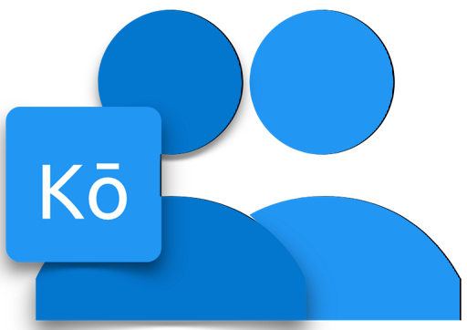

<!--
**** Shoutout to othneildrew for the amazing readme template!
-->

<!-- BADGES -->

<!-- PROJECT LOGO -->
 

  

  <h1 align="center">Gakkōα</h1>

  

    Moderná e-nástenka a informačný systém pre školy zdarma
     
    <a href="https://github.com/ttomovcik/gakko/wiki"><strong>Dokumentácia »</strong></a>
     
     
    <a href="https://github.com/ttomovcik/gakko/">Demo</a>
    ·
    <a href="https://github.com/ttomovcik/gakko/issues">Nahlásiť chybu</a>
    ·
    <a href="https://github.com/ttomovcik/gakko/issues">Poslať návrhy</a>
  

<!-- OBSAH -->
## Obsah

* [🤔 O projekte](#-o-projekte)
  * [Použité nástroje](#Použité-nástroje)
  * [Dokumenty zo súťaže SOČ](#Dokumenty-zo-súťaže-SOČ)
* [🎉 Začíname](#-Začíname)
  * [Požiadavky](#Požiadavky)
  * [Prvé spustenie](#Prvé-spustenie)
* [🦄 Jednorožce](#-Jednorožce)
* [🤦‍ Licencia](#-Licencia)
* [😯 Kontakt](#-Kontakt)
* [🥣 Omáčky na záver](#-Omáčky-na-záver)

# 🤔 O projekte
Gakkō je moderná e-nástenka a informačný systém pre školy zdarma. Momentálne je v štádiu vývoja, no dá sa otestovať už teraz. Stačí kliknúť na odkaz "demo" pod logom vyššie. 

Tento projekt začínal ako mobilná aplikácia na maturitný projekt, no nakoniec sa prerába na progresívnu webovú aplikácie, pretože Edupage už mobilnú appku má. (No takúto čačanú nástenku nie 😊). A aby toho nebolo málo, bol poslaný aj na súťaž SOČ (2019) a bohvie kam to dotiahnem celé. 🤷‍. 

>Ešte jedna vec, túto dokumentáciu niekedy upravím nech to dajako vyzerá, no dnes to nebude.

## Použité nástroje
>Kiežby sa to samé naprogramovalo (..alebo skopírovalo zo StackOverflow a pod.)

- [Visual Studio Code](https://code.visualstudio.com)
- [Google Firebase](https://firebase.google.com)
- [Káva, alebo niečo tekuté](https://youtu.be/n0rftjZBq8Y)

## Dokumenty zo súťaže SOČ
>Niekedy by ich aj mal nahrať 🤷‍

# 🎉 Začíname
Čierna mágia je [na tejto stránke](https://gakko-webapp.firebaseapp.com/). Tu stačí kliknúť na položku "Demo" a malo by to fungovať. Ako som povedal, je to v štádiu vývoja.

## Požiadavky
>Nič hrozné, hoci čo s prístupom na internet.

Pre odvážnych **Internet Explorer 9**, inak **Firefox** alebo ten oný, **Google Chrome**.

## Prvé spustenie
Ak sa ti podarilo dostať na tú stránku a dačo tam pošťukať, klobúk dolu. Niekde tam nájdi nastavenia a hraj sa. 

# 🦄 Jednorožce
Ak si klikol / klikla na toto ako prvé:

- Toto je maturitný projekt a práca na SOČ
- Môžeš napríklad pomôcť pri vývoji
- Odporúčam prečítať si túto dokumentáciu celú, hlavne [o projekte](#-O-projekte), a samozrejme [omáčky na záver](#-Omáčky-na-záver). Ostatné až tak podstatné nie je

# 🤦 Licencia
No, používam Apache 2.0...

# 😯 Kontakt
Autorom projektu je **Tomáš Tomovčík**
* [Github](https://github.com/ttomovcik)
* [Facebook](https://facebook.com/ttomovcik)
* [Twitter, na ktorom mám zablokovaný účet](https://twitter.com/@ttomovcik)
* [Instagram (ja viem, ja viem...)](https://www.instagram.com/_ttomovcik/)

# 🥣 Omáčky na záver
Ako som už povedal, toto je maturitný projekt a práca na SOČ. Keď mám čas tak dačo porobím v tomto repo, pridám nejaký ten bug, opravím dačo alebo pridám novú funkciu. Inak tma. Ešte k tejto dokumentácii. Snažil som sa až to pochopí každý, preto tu sú takéto slová. Kontakt je vyššie keby niečo, no a toť asi všetko. 
